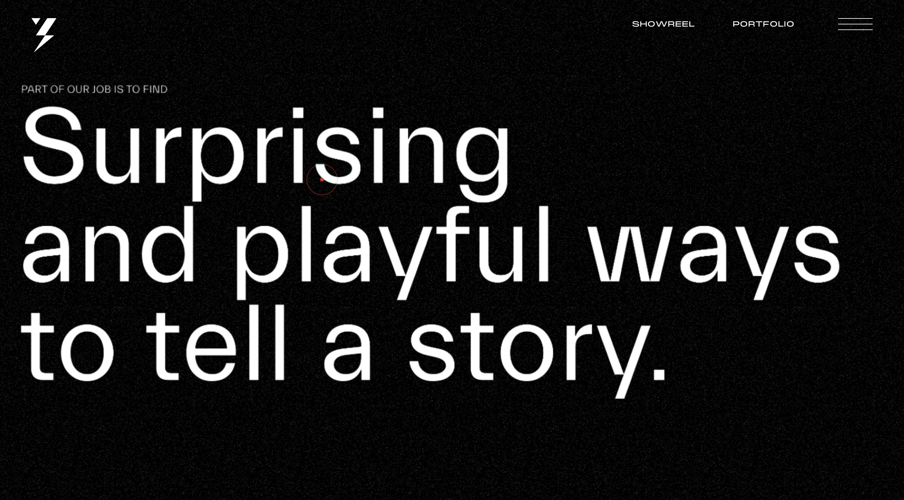
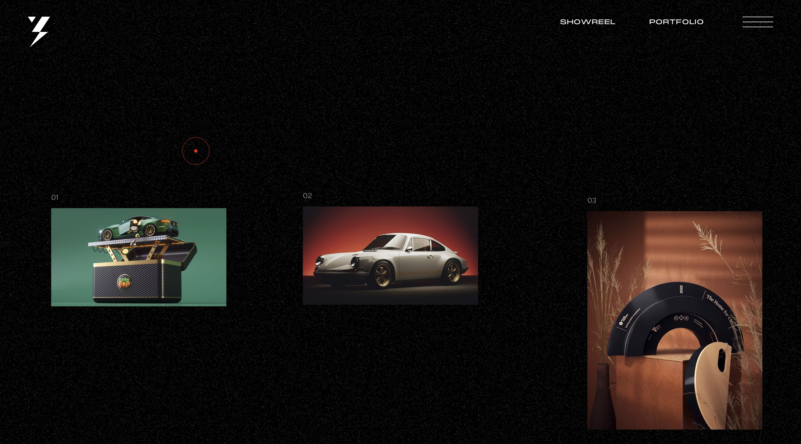
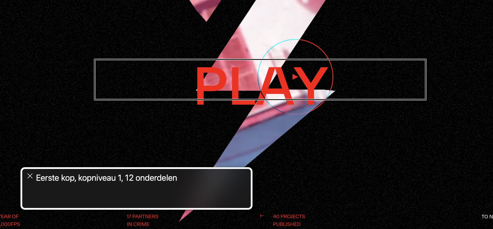
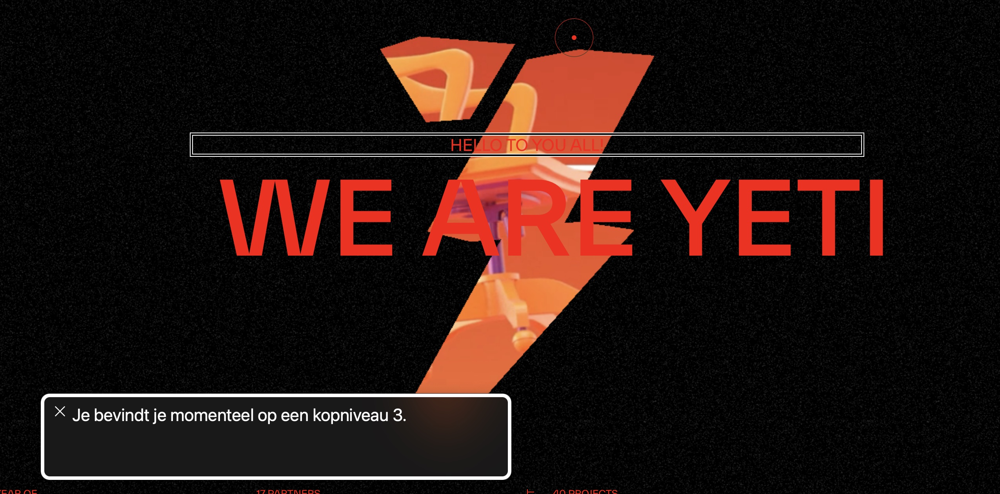
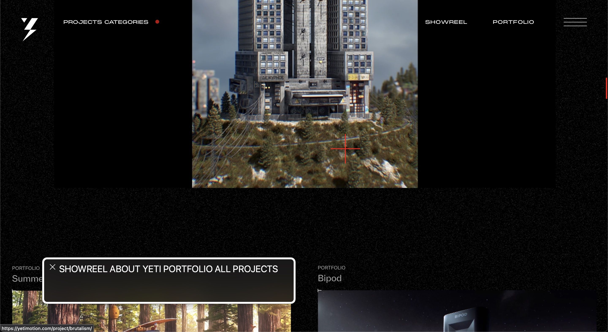
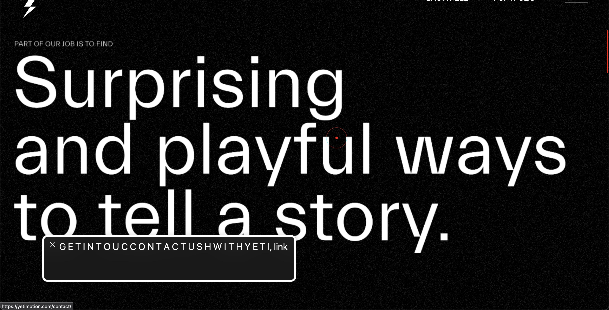
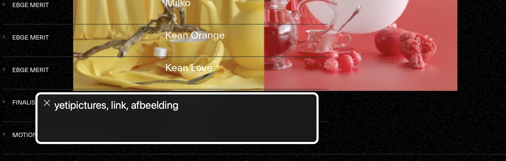
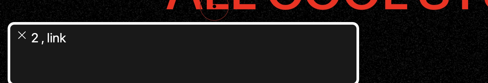
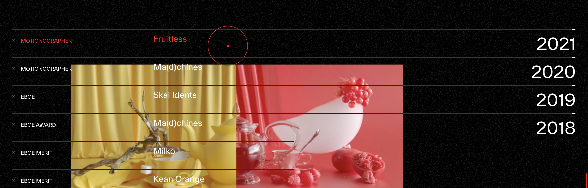
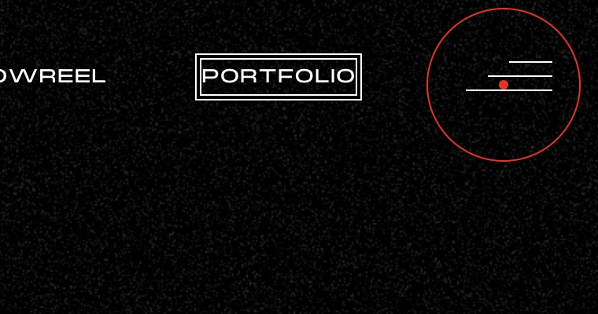

# Procesverslag
Markdown is een simpele manier om HTML te schrijven.  
Markdown cheat cheet: [Hulp bij het schrijven van Markdown](https://github.com/adam-p/markdown-here/wiki/Markdown-Cheatsheet).

Nb. De standaardstructuur en de spartaanse opmaak van de README.md zijn helemaal prima. Het gaat om de inhoud van je procesverslag. Besteedt de tijd voor pracht en praal aan je website.

Nb. Door *open* toe te voegen aan een *details* element kun je deze standaard open zetten. Fijn om dat steeds voor de relevante stuk(ken) te doen.

## Jij

  
uitwerken voor kick-off werkgroep

  ### Auteur:
  Kim Dekker

  #### Je startniveau:
  Zwart

  #### Je focus:
  Surface layer is de focus, daarna komt het responsive maken erbij.
 

## Je website

  
uitwerken voor kick-off werkgroep

  ### Je opdracht:
https://yetimotion.com/

  #### Screenshot(s) van de eerste pagina (small screen): 
https://yetimotion.com/about/
  

  #### Screenshot(s) van de tweede pagina (small screen):
https://yetimotion.com/studiolife_category/all-cool-stuff/
  
 

## Toegankelijkheidstest 1/2 (week 1)

  
uitwerken na test in 2e werkgroep

  ### Bevindingen
  Lijst met je bevindingen die in de test naar voren kwamen:

  1. in de about pagina werkt de screenreader niet goed. Dat komt door functie dat je kan hoveren over de headers om een andere header te krijgen. Dit is niet goed gebouwd en daardoor raakt de screenreader van de leg.
  

  2. De eerste kop is een kop niveau 3. Het zou semantisch beter gecodeert zijn als de eerste kop een H1 was geweest.
  

  3. Ik raak constant kwijt waar de screenreader op de pagina is. Dit is een indicatie dat de HTML niet juist/semantisch is gestructureerd. Hierdoor kunnen mensen die navigeren met screenreader niet fijn navigeren over de site.
  

  4. De titel die in de afbeelding te zien is zou in 1x moeten zeggen "PART OF OUR JOB IS TO FIND etc.". Daarintegen leest de screenreader elke keer maar 1 woord. Tevens spreekt de screenreader de woorden na FIND nieteens uit. 
  

  5. Inhakend op punt 4. Het volgende wat de screenreader leest na punt 4 is een volgende titel, maar omdat deze niet netjes in de pagina is gezet (een beetje lui), begint de screenreader de hele zin in aparte hoofdletters op te lezen (als een soort alfabet).
  

  6. Linkjes staan in de website over het algemeen gewoon te vaag vermeld. De ene keer met nummers, de andere keer zonder tekst en dan weer met alleen een indicatie van een afbeelding... Als slechtziend persoon zou ik dit een feedback loop from hell hebben gevonden. 
  
    

  7. Bij het hoveren over de linkjes te zien in de afbeelding, komt er een bewegende animatie op de achtergrond die dan mooi met de muis meebeweegt. Net als meerdere van dit soort flashy animaties/video's/content, is dit nergens op de website uit te zetten voor gebruikers die niet tegen dit soort flashy content kunnen.
  

  8. De structuur van het menu begint prima, maar we kunnen het hamburger menu niet selecteren, waardoor navigeren over de website onmogelijk wordt gemaakt. Je zou nu dus eerst helemaal naar de footer moeten, om daar meer opties te krijgen (maar hoe weet een gebruiker dat dan?). Overall is het navigeren over de website ontzettend confusing en ik raak contant in de war over waar ik ben.
  

  ##### Conclustie
  Navigeren over de website werd mij als screenreader-gebruiker eigelijk onmogelijk gemaakt. Als ik een doel had om naar heen te gaan, kostte het zoveel moeite dat ik niet anders kon dan begeleiden met scrollen en muisklikken, maar dat kan niet iedereen. Toegankelijkheid zou alleen op dit punt al falen, maar daarbij komt kijken dat heel de HTML structuur niet juist is > slechte linkjes, slechte headers en geen alt text maakt het voor screenreader-gebruikers helemaal niet duidelijk waar ze op de website zijn en wat voor content ze nou aan het lezen zijn.

## Breakdownschets (week 1)

  
uitwerken na afloop 3e werkgroep

  ### de hele pagina: 
  

  ### dynamisch deel (bijv menu): 
  

  ### wellicht nog een dynamisch deel (bijv filter): 
  

## Voortgang 1 (week 2)

  
uitwerken voor 1e voortgang

  ### Stand van zaken
  hier dit ging goed & dit was lastig (neem ook screenshots op van delen van je website en code)

  ### Agenda voor meeting
  samen met je groepje opstellen

  | student 1      | student 2          | student 3    | student 4        |
  | ---            | ---                | ---          | ---              |
  | dit bespreken  | en dit             | en ik dit    | en dan ik dat    |
  | en dat ook nog | dit als er tijd is | nog een punt | dit wil ik zeker |
  | ...            | ...                | ...          | ...              |

  ### Verslag van meeting
  hier na afloop snel de uitkomsten van de meeting vastleggen

  - punt 1
  - punt 2
  - nog een punt
  - ...

## Voortgang 2 (week 3)

  
uitwerken voor 2e voortgang

  ### Stand van zaken
  hier dit ging goed & dit was lastig (neem ook screenshots op van delen van je website en code)

  ### Agenda voor meeting
  samen met je groepje opstellen

  | student 1      | student 2          | student 3    | student 4        |
  | ---            | ---                | ---          | ---              |
  | dit bespreken  | en dit             | en ik dit    | en dan ik dat    |
  | en dat ook nog | dit als er tijd is | nog een punt | dit wil ik zeker |
  | ...            | ...                | ...          | ...              |

  ### Verslag van meeting
  hier na afloop snel de uitkomsten van de meeting vastleggen

  - punt 1
  - punt 2
  - nog een punt
- ...

## Toegankelijkheidstest 2/2 (week 4)

  
uitwerken na test in 9e werkgroep

  ### Bevindingen
  Lijst met je bevindingen die in de test naar voren kwamen (geef ook aan wat er verbeterd is):

## Voortgang 3 (week 4)

  
uitwerken voor 3e voortgang

  ### Stand van zaken
  hier dit ging goed & dit was lastig (neem ook screenshots op van delen van je website en code)

  ### Agenda voor meeting
  samen met je groepje opstellen

  | student 1      | student 2          | student 3    | student 4        |
  | ---            | ---                | ---          | ---              |
  | dit bespreken  | en dit             | en ik dit    | en dan ik dat    |
  | en dat ook nog | dit als er tijd is | nog een punt | dit wil ik zeker |
  | ...            | ...                | ...          | ...              |

  ### Verslag van meeting
  hier na afloop snel de uitkomsten van de meeting vastleggen

  - punt 1
  - punt 2
  - nog een punt
  - ...

## Eindgesprek (week 5)

  
uitwerken voor eindgesprek

  ### Je uitkomst - karakteristiek screenshots:
  

  ### Dit ging goed/Heb ik geleerd: 
  Korte omschrijving met plaatjes

  

  ### Dit was lastig/Is niet gelukt:
  Korte omschrijving met plaatjes

  

## Bronnenlijst

  
continu bijhouden terwijl je werkt

  Nb. Wees specifiek ('css-tricks' als bron is bijv. niet specifiek genoeg). 
  Nb. ChatGpT en andere AI horen er ook bij.
  Nb. Vermeld de bronnen ook in je code.

  1. bron 1
  2. bron 2
  3. ...

