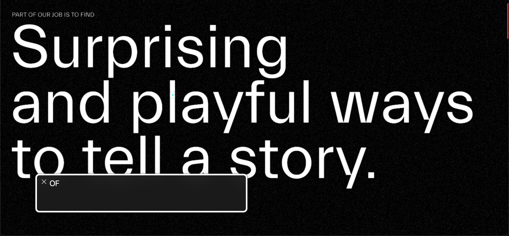

# Procesverslag
Markdown is een simpele manier om HTML te schrijven..
Markdown cheat cheet: [Hulp bij het schrijven van Markdown](https://github.com/adam-p/markdown-here/wiki/Markdown-Cheatsheet).

Nb. De standaardstructuur en de spartaanse opmaak van de README.md zijn helemaal prima. Het gaat om de inhoud van je procesverslag. Besteedt de tijd voor pracht en praal aan je website.

Nb. Door *open* toe te voegen aan een *details* element kun je deze standaard open zetten. Fijn om dat steeds voor de relevante stuk(ken) te doen.

## Jij

  
uitwerken voor kick-off werkgroep

  ### Auteur:
  Kim Dekker

  #### Je startniveau:
  Zwart

  #### Je focus:
  Surface layer is de focus, daarna komt het responsive maken erbij.
 

## Je website

  
uitwerken voor kick-off werkgroep

  ### Je opdracht:
https://yetimotion.com/

  #### Screenshot(s) van de eerste pagina (small screen): 
https://yetimotion.com/about/
  

  #### Screenshot(s) van de tweede pagina (small screen):
https://yetimotion.com/studiolife_category/all-cool-stuff/
  
 

## Toegankelijkheidstest 1/2 (week 1)

  
uitwerken na test in 2e werkgroep

  ### Bevindingen
  Lijst met je bevindingen die in de test naar voren kwamen:

  1. in de about pagina werkt de screenreader niet goed. Dat komt door functie dat je kan hoveren over de headers om een andere header te krijgen. Dit is niet goed gebouwd en daardoor raakt de screenreader van de leg.
  

  2. De eerste kop is een kop niveau 3. Het zou semantisch beter gecodeert zijn als de eerste kop een H1 was geweest.
  

  3. Ik raak constant kwijt waar de screenreader op de pagina is. Dit is een indicatie dat de HTML niet juist/semantisch is gestructureerd. Hierdoor kunnen mensen die navigeren met screenreader niet fijn navigeren over de site.
  

  4. De titel die in de afbeelding te zien is zou in 1x moeten zeggen "PART OF OUR JOB IS TO FIND etc.". Daarintegen leest de screenreader elke keer maar 1 woord. Tevens spreekt de screenreader de woorden na FIND nieteens uit. 
  

  5. Inhakend op punt 4. Het volgende wat de screenreader leest na punt 4 is een volgende titel, maar omdat deze niet netjes in de pagina is gezet (een beetje lui), begint de screenreader de hele zin in aparte hoofdletters op te lezen (als een soort alfabet).
  

  6. Linkjes staan in de website over het algemeen gewoon te vaag vermeld. De ene keer met nummers, de andere keer zonder tekst en dan weer met alleen een indicatie van een afbeelding... Als slechtziend persoon zou ik dit een feedback loop from hell hebben gevonden. 
  
    

  7. Bij het hoveren over de linkjes te zien in de afbeelding, komt er een bewegende animatie op de achtergrond die dan mooi met de muis meebeweegt. Net als meerdere van dit soort flashy animaties/video's/content, is dit nergens op de website uit te zetten voor gebruikers die niet tegen dit soort flashy content kunnen.
  

  8. De structuur van het menu begint prima, maar we kunnen het hamburger menu niet selecteren, waardoor navigeren over de website onmogelijk wordt gemaakt. Je zou nu dus eerst helemaal naar de footer moeten, om daar meer opties te krijgen (maar hoe weet een gebruiker dat dan?). Overall is het navigeren over de website ontzettend confusing en ik raak contant in de war over waar ik ben.
  

  ##### Conclustie
  Navigeren over de website werd mij als screenreader-gebruiker eigelijk onmogelijk gemaakt. Als ik een doel had om naar heen te gaan, kostte het zoveel moeite dat ik niet anders kon dan begeleiden met scrollen en muisklikken, maar dat kan niet iedereen. Toegankelijkheid zou alleen op dit punt al falen, maar daarbij komt kijken dat heel de HTML structuur niet juist is > slechte linkjes, slechte headers en geen alt text maakt het voor screenreader-gebruikers helemaal niet duidelijk waar ze op de website zijn en wat voor content ze nou aan het lezen zijn.

## Breakdownschets (week 1)

  
uitwerken na afloop 3e werkgroep

  ### de hele pagina: 
  

  ### dynamisch deel (bijv menu): 
  

  ### wellicht nog een dynamisch deel (bijv filter): 
  

## Voortgang 1 (week 2)

  
uitwerken voor 1e voortgang

  ### Stand van zaken
  hier dit ging goed & dit was lastig (neem ook screenshots op van delen van je website en code)

    Veel gaat eigelijk heel goed. Zoals het maken van een fijne root, calc's includeren, dark en light modes, een fancy ::selection en al wat JavaScript. Kortom, ik vermaak me wel!
  
  
  
  

  ### Agenda voor meeting
  samen met je groepje opstellen

  

  | Kim                                                                                  | Valentijn          | Alia         | Ananda           |
  | ---                                                                                  | ---                | ---          | ---              |
  | Een icon is i, nest je daarin een a, of is het andersom                              | en dit             | en ik dit    | en dan ik dat    |
  | Kan je een span binnen button gebruiken als de streepjes van het hamburger menu icon | dit als er tijd is | nog een punt | dit wil ik zeker |
  | Hover hamburger menu met JS  .onclick blijft hoveren na click > moet niet > hoe?     | ...                | ...          | ...              |

  ### Verslag van meeting
  hier na afloop snel de uitkomsten van de meeting vastleggen

  - Nog wat listjes toevoegen aan de stack met social media icons
  - Van de article een Table of een List maken. Mag ik zelf weten
  - Nog wat linkjes in het lijstje met "what we can do for you"
  - Mannen waren tevreden en vonden dat ik al hele nette code aan het schrijven ben
  - Heb wat advies gekregen over hoe ik mijn hamburger menu kan afmaken.
  - Marquee gebruiken voor alle teksten die als een kermis atractie binnen komen rollen

## Voortgang 2 (week 3)

  
uitwerken voor 2e voortgang

  ### Stand van zaken
  Dit ging goed:
  - Animaties namaken
  - gecompliceerde dingen afmaken en afvinken
  - tinkeren met leuke dingen en het uiteindelijk voor elkaar krijgen

  Dit kan beter:
  Ik heb op dit moment nog niks dat per definitie beter kan. Ik ben nu gewoon lekker bezig en heb nog geen punten van kritiek. Deze komen vast laten nog wel...

  ### Agenda voor meeting
  samen met je groepje opstellen
  De rest van de groep hadden vragen die voor mij niet relevant waren om te vragen, dus heb ik deze niet meegenomen in mijn Readme

  | Kim                                                                    | Ananda             | Valentijn      | Alia             |
  | ---                                                                    | ---                | ---            | ---              |
  | Tekst moet warpen als ik eroverheen hover, hoe kan ik dat doen?        | ...                | ...            | ...              |
  | Logosection is met flex gedaan, had ik het beter met grid kunnen doen? | ...                | ...            | ...              |
  | Hover op kruisje werkt nog niet helemaal zoals ik wil dat het doet     | ...                | ...            | ...              |

  ### Verslag van meeting
  hier na afloop snel de uitkomsten van de meeting vastleggen

  - De textwarp is te doen met libraries en ik heb waarschijnlijk een canvas nodig. Is gecomliceerd en als ik interesse heb kan ik Cyd Stumpel vragen om hier wat over uit te leggen 
  - Logosection is prima met flexbox. Het maakt helemaal niks uit wat je gebruikt. Vooral in dit geval.
  - De hover op het kruisje is gefixt. de .hover moest nog op een aantal selectors en dan kon ik de width aanpassen op de focus. Was een principe dat ik zelf had kunnen zien als ik in de CSS beter had verwoord welke functie met welke reageert in JS

  
  Sectie dat moet warpen tijdens het hoveren

  
  Gefixte kruisje die niet meer bugd

  
  De sectie met de logo's

##### Samenvatting meeting
- Het gaat goed met de code
- Heb in de meeting ook anderen in het groepje geholpen als een soort semi-assistent
- Ik heb Cyd een berichtje gestuurd omdat ik wel geinteresseerd ben in Cyd haar kennis en portfolio
- Veel dingen die ik al wel werkend heb hebben nog een kleine finishing touch nodig. Denk aan: dark mode perfectionaliseren, animations minderen voor mensen die daar gevoelig voor zijn.

## Toegankelijkheidstest 2/2 (week 4)

  
uitwerken na test in 9e werkgroep

  ### Bevindingen

  Wat kan nog beter:
  - dark mode is nog niet perfect
  - er zijn nog een aantal dingen die bewegen als de modus voor overgevoeligheid aan staat. Kan beter
  - Tabs lijken niet overal juist te werken. Moet gefixt worden
  - Sommige knoppen hebben nog een focus state nodig
  - De video is nogsteeds autoplay
  - Pagina heeft nog geen skip link
  - De tekst kan nog niet vergroot worden, alhoewel de teskt in het algemeen al redelijk groot is

  Wat is verbeterd:
  - Overall HTML structuur is veel beter, waardoor heel veel op de lijst is verbeterd.
  - Beter te volgen voor screenreaders. Ik ben niet meer verloren waar ik ben
  - De website is toegankelijk gemaakt voor mensen die gevoelig zijn voor beweging
  - Er is een darkmode aanwezig
  - buttons zijn buttons, en linkjes zijn a's
  - De headers zijn goed gestructureerd
  - Website is geheel responsive zonder dat de pagina opnieuw inlaadt
  - Afbeeldingen en video's hebben een alt text
  - De alt text is relevant

##### Conclustie
  Er zijn nog wat kleine dingen die aangepast en/of verbeterd kunnen worden.
  Waar ik prioriteit aan geef:
  - Dark mode afmaken
  - Tabs fixen
  - Focus states afmaken
  - Reduced motion afmaken

  Dingen die ik ga doen als er tijd voor is en de rest af is:
  - skip link maken
  - Text 200% functie

  Verder is de website al een stuk verbeterd ten opzichte van het oude model. Dus hebben we het doel nu al behaald. Fijn.

## Voortgang 3 (week 4)

  
uitwerken voor 3e voortgang

  ### Stand van zaken
  hier dit ging goed & dit was lastig (neem ook screenshots op van delen van je website en code)
  Wat ging goed:
  - mouseover met JS maken
  - Meer JS functies afmaken
  - Werken met grid om de laatste sectie af te maken
  - 1E pagina helemaal afgemaakt (op kleine complicated dingetjes na die nog iets meer tijd nodig hebben)
  - Veel punten gefixt die in de test van eerder deze week nog wat aandacht nodig hadden

  Wat was lastig:
  Er zijn/waren een aantal dingen die ik nog niet voor elkaar krijg/kreeg:
  - radiobuttons filter (nog niet gefixt)
  - Smooth hover over background-image (nog niet gefixt)
  - Scroll animaties (nog niet ondekt hoe)

  ### Agenda voor meeting
  samen met je groepje opstellen

  Net als vorige keer waren de vragen van mijn teamgenoten niet relevant voor mij dus heb ik ze niet verwerkt in mijn readme. Ik heb hun vragen samen met de student assistenten opgelost.

  | Kim                                                             | Ananda             | Valentijn    | Alia      |
  | ---                                                             | ---                | ---          | ---       |
  | Hoe kan je sections in-animeren?                                | ...                | ...          | ...       |
  | Hoe maak je een smooth hover als je werkt met background image? | ...                | ...          | ...       |

  ### Verslag van meeting
  hier na afloop snel de uitkomsten van de meeting vastleggen.

  De vragen die ik had heb ik achteraf na de meeting aan Sanne gevraagd, omdat mijn team vragen had die wat belangrijker waren om te fixen en ik het idee had dat die meer spoed hadden om op te lossen en ik zelf er wel uitkom.

  - Punt 1 heb ik uiteindelijk zelf weten op te lossen, omdat ik Bahaa hoorde praten over intersection observer.
  - Een smooth (transition: etc.) hover op een background image werkt niet. Daarom hebben we een pseudo-class ::before nodig. Op deze manier heb ik het samen met Sanne opgelost. Code makes sense. ik begrijp het en kan het nu vaker gebruiken.

##### Samenvatting meeting
Er is nog wel redelijk wat te doen. Er moet noig gewerkt worden aan de 2e pagina. Ook moeten er nog kleine dingen worden gedaan vind ik zelf. Ook wil ik wat tijd besteden aan die canvas dingen en ga aankomende maandag daarom met Cyd praten. 

Heel veel dingen werken ook wel al, daar ben ik tevreden over, maar wil wel de lat hoog leggen voor mezelf, omdat ik er zo veel mogelijk uit wil halen om te kunnen leren. Niet dat ik niks heb geleerd, heel veel zelfs. Ik heb het idee dat ik in een paar weken mezelf heb verdriedubbelt in kennis over front-end.

## Eindgesprek (week 5)

  
uitwerken voor eindgesprek

  ### Je uitkomst - karakteristiek screenshots:
  

  ### Dit ging goed/Heb ik geleerd: 
  Korte omschrijving met plaatjes

  

  ### Dit was lastig/Is niet gelukt:
  Korte omschrijving met plaatjes

  

## Bronnenlijst

  
continu bijhouden terwijl je werkt

  Nb. Wees specifiek ('css-tricks' als bron is bijv. niet specifiek genoeg). 
  Nb. ChatGpT en andere AI horen er ook bij.
  Nb. Vermeld de bronnen ook in je code.

  In al mijn bronnen heb ik zelf nog (veel) gespeeld met de source om het zo te maken dat het werkt voor mijn project specfiek. Ik heb eigelijk nergens de code plat gecopy paste en gelaten zoals het is.

  1. https://stackoverflow.com/questions/14387690/how-can-i-show-only-corner-borders voor de border hoeken in de knoppen bij Latest awards (in de index.html)
  2. https://www.graphicpie.com/css-text-hover-effects/ en dan punt 18 = bron van text animation hover. Daarna zelf nog mee getinkerd
  3. https://jsfiddle.net/ydchauh/4cbk0sq5/ het startpunt voor de cursor. Deze heb ik vervolgens nog wel aangepast zodat het werkt met custom properties en translate -50% trics.
  4. https://developer.mozilla.org/en-US/docs/Web/API/Intersection_Observer_API bron om Intersection observer te begrijpen en toe te passen in de website. 
  5. Chat GPT om een template te maken voor m'n section observer functie. Deze heb ik vervolgens helemaal gevormd naar wat voor mij relevant is.
  6. Chat GPT voor de radiobuttons filter
  7. Sanne t' Hooft voor hulp en duwtjes in de goede richting
  8. Cyd Stumpel voor het aaraden van wat libraries als: three.js, Lenis en GSAP. Ook voor bronnen als tympanus.net en Yuri Artiukh (YT)

